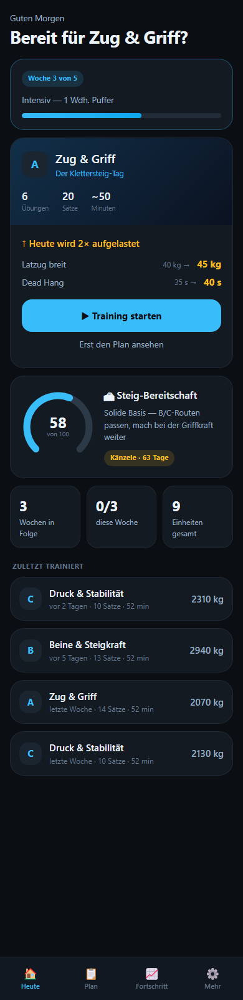
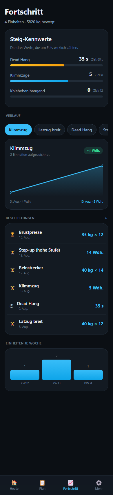

# FerrataFit

Eine private Trainings-App für dein Multifunktionsgerät, ausgelegt auf **Allgemeinfitness,
leichte Definition und vor allem bessere Leistung am Klettersteig**.

Die App kennt deinen Split, merkt sich jede Last und sagt dir von selbst, wann aus 40 kg
45 kg werden. Es gibt sie zweimal: als **Android-App** und als **Web-App**, die im Browser
läuft und sich auf dem Homescreen ablegen lässt. Beide rechnen mit derselben Logik.

Die Begründung für jede Trainingsregel steht in [TRAININGSWISSEN.md](TRAININGSWISSEN.md).

| Heute | Training | Fortschritt |
|---|---|---|
|  |  |  |

---

## Android-App installieren

1. `FerrataFit.apk` aufs Handy kopieren — per USB-Kabel, über Nearby Share, oder du
   lädst sie direkt aus diesem Repository herunter.
2. Auf dem Handy die Datei antippen.
3. Android fragt nach der Erlaubnis, Apps aus dieser Quelle zu installieren — bestätigen.
   (Die App kommt nicht aus dem Play Store, daher die Rückfrage.)
4. Installieren, fertig.

Die App braucht **keine Internetverbindung** und sendet nichts an einen Server.
Alle Daten bleiben auf dem Gerät.

## Web-App starten

Die Web-Variante liegt in [`web/`](web/). Sie verwendet ES-Module und braucht deshalb
einen kleinen HTTP-Server — ein Doppelklick auf die `index.html` reicht nicht.

```bash
cd /mnt/c/Users/Rudeboy/Documents/FerrataFit/web && python3 -m http.server 8765
```

Dann im Browser `http://localhost:8765` öffnen. Über das Browsermenü lässt sie sich als
App installieren („Zum Startbildschirm hinzufügen" bzw. „Installieren"); danach startet
sie im eigenen Fenster ohne Adressleiste und funktioniert dank Service Worker auch offline.

Wenn du sie auf dem Handy nutzen willst, ohne den Rechner laufen zu lassen, kannst du den
Ordner `web/` auf jeden beliebigen Webspace legen — es sind reine statische Dateien.

**Unterschied zur Android-App:** Die Web-Variante kann nicht mit Samsung Health sprechen,
dafür fehlt dem Browser der Zugang zu Health Connect. Alles andere ist identisch. Die
Daten der beiden Varianten sind getrennt; über Export/Import lassen sie sich übertragen.

---

## Erster Start

Beim ersten Öffnen führen dich beide Varianten durch drei Schritte:

1. **Ausstattung** — hak ab, welche Stationen dein Gerät hat. Es werden nur Übungen
   eingeplant, die du damit auch ausführen kannst.
2. **Körpergewicht und Gewichtsstufe** — daraus schätzt die App deine Startlasten. Die
   Gewichtsstufe ist der Sprung von einer Steckplatte zur nächsten, meist 5 kg.
3. **Ziel** — wenn du eine Tour im Blick hast, trag sie ein. Die App zählt dann rückwärts.

Die erste Einheit jeder Übung dient nur dazu, deine Lasten zu finden. Ab der zweiten
beginnt die App zu steigern.

## Die vier Bereiche

**Heute** — was als Nächstes dran ist, was heute aufgelastet wird, deine Steig-Bereitschaft
und der Countdown zur Tour.

**Plan** — alle drei Trainingstage zum Aufklappen. Zu jeder Übung findest du die Ausführung
und warum sie für den Steig zählt. Übungen, die dir nicht liegen, kannst du ausblenden.

**Fortschritt** — deine drei Steig-Kennwerte (Dead Hang, Klimmzüge, Knieheben) mit
Zielmarken, Verlaufskurven je Übung, Bestleistungen und Einheiten pro Woche.

**Mehr** — Samsung-Health-Verbindung, Profil, Ausstattung ändern, Block neu starten,
Datensicherung.

## Während des Trainings

- Oben wechselst du per Chip zwischen den Übungen.
- Die große Zahl ist der Vorschlag für heute. Bei einer Steigerung siehst du
  `40 kg → 45 kg` und den Grund darunter.
- Jeden Satz mit dem Häkchen abschließen — das startet die Pausenuhr.
- Das Kopier-Symbol überträgt die Werte eines Satzes auf alle folgenden.
- **Nur abgehakte Sätze werden gespeichert.**

---

## Samsung Health (nur Android)

Samsung bietet ein eigenes SDK an, das aber eine Partnerfreigabe voraussetzt und für eine
private App nicht in Frage kommt. Der offene Weg führt über **Health Connect**: Samsung
Health gleicht Training, Schritte und Puls damit in beide Richtungen ab.

1. In FerrataFit auf **Mehr → Mit Samsung Health verbinden**.
2. Health Connect fragt nach den Freigaben — bestätigen.
3. In der **Samsung-Health-App** einmalig prüfen, dass die Synchronisation aktiv ist:
   *Einstellungen → Health Connect*.

Danach landet jede abgeschlossene Einheit als Krafttraining in Samsung Health. Der
Abgleich läuft nicht sekundengenau, sondern typischerweise innerhalb einer Stunde. Über
**Alles übertragen** schiebst du auch ältere Einheiten nach.

Ab Android 14 ist Health Connect fest im System eingebaut; auf älteren Geräten bietet die
App an, es aus dem Play Store nachzuinstallieren.

Kommt nichts an: Auf Samsung-Seite gab es zuletzt wiederholt Fehler beim Abgleich mit
Health Connect. Meist hilft ein Neustart von Samsung Health oder ein Aus- und Einschalten
der Synchronisation dort.

---

## Selbst bauen

```bash
bash build.sh
```

Die fertige `FerrataFit.apk` landet im Projektordner.

Voraussetzungen auf dieser Maschine:
- JDK 17 unter `~/android/jdk`
- Android SDK unter `~/android/sdk` mit Plattform 36 und Build-Tools 36
- Gradle 8.11.1 unter `~/android/tools/gradle-8.11.1`

Das Projekt lässt sich ebenso in Android Studio öffnen.

**Signatur:** Die Zugangsdaten stehen in `keystore.properties`, der Schlüssel selbst in
`keystore/`. Beides ist vom Repository ausgeschlossen. Auf einer frisch geklonten Kopie
ohne diese Dateien baut Gradle weiter, nimmt dann aber den Debug-Schlüssel — eine so
gebaute APK lässt sich nicht über eine bereits installierte Version legen.

**Behalte den Schlüssel.** Geht er verloren, musst du bei einem Update die alte App
deinstallieren (Trainingsdaten vorher exportieren).

## Tests

```bash
node web/test-progression.mjs
```

Prüft die Progressionslogik der Web-Variante gegen dieselben 13 Fälle, die auch der
Kotlin-Test abdeckt — so ist sichergestellt, dass Handy und Browser identisch rechnen.

Für die Android-Seite:

```bash
cd /mnt/c/Users/Rudeboy/Documents/FerrataFit && JAVA_HOME=~/android/jdk ANDROID_HOME=~/android/sdk FERRATAFIT_BUILD_DIR=~/.ferratafit-build ~/android/tools/gradle-8.11.1/bin/gradle :app:testReleaseUnitTest
```

---

## Was wo liegt

| Pfad | Inhalt |
|---|---|
| `FerrataFit.apk` | Die fertige Android-App |
| `TRAININGSWISSEN.md` | Trainingslehre hinter der App, mit Quellen |
| `build.sh` | Android-App neu bauen |
| `app/src/main/java/…/data/` | Übungskatalog, Split, Progressionslogik, Speicherung |
| `app/src/main/java/…/ui/` | Oberfläche (Jetpack Compose) |
| `app/src/main/java/…/health/` | Samsung-Health-Anbindung über Health Connect |
| `app/src/test/` | Tests der Progressionslogik |
| `web/` | Web-Variante (HTML, CSS, JavaScript, ohne Build-Schritt) |
| `screenshots/` | Bilder für dieses README |
| `keystore/` | Signaturschlüssel — **nicht im Repository**, lokal aufbewahren |

## Datensicherung

Unter **Mehr → Export** bekommst du deinen kompletten Bestand als Datei. Vor einem
Gerätewechsel einmal machen — auf dem neuen Gerät liest du sie über **Import** wieder ein.
Das funktioniert auch zwischen Android-App und Web-Variante.
