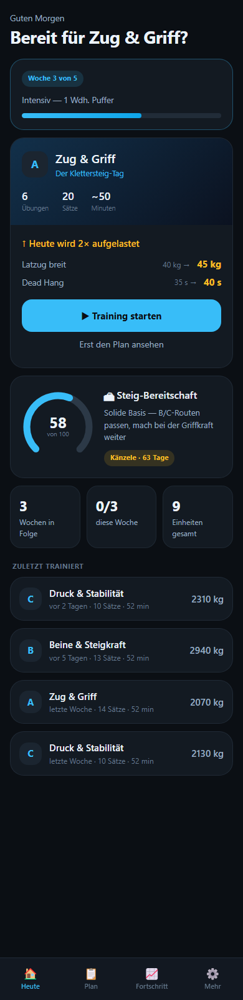
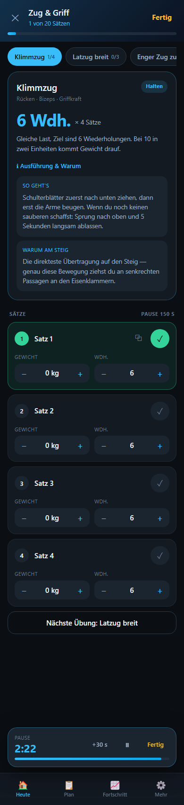
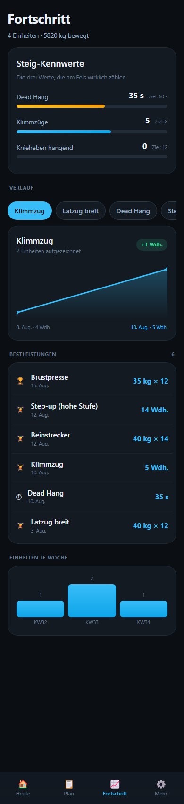

# 🏔 FerrataFit — Kraft für den Klettersteig

Trainings-App für das eigene Multifunktionsgerät, ausgelegt auf **Allgemeinfitness,
leichte Definition und bessere Leistung am Klettersteig** — als Android-App und Web-App.
Keine Anmeldung, keine Datensammlung, kein Server. Alles bleibt auf dem Gerät.

Die App merkt sich jede Last und sagt von selbst, wann aus 40 kg 45 kg werden.

<div align="center">

[](https://github.com/Only1Rudeboy/FerrataFit/releases/latest/download/FerrataFit.apk)

</div>

## 📱 Nutzen

- **Android-App (APK):** [FerrataFit.apk herunterladen](https://github.com/Only1Rudeboy/FerrataFit/releases/latest/download/FerrataFit.apk)
  — Installation aus unbekannter Quelle bestätigen. Ab Android 8. Nur diese Variante
  kann mit Samsung Health sprechen.
- **Web-App:** Ordner [`web/`](web/) auf einen beliebigen Webspace legen oder lokal starten
  (`cd web && python3 -m http.server 8765`, dann `http://localhost:8765`). Über
  „App installieren" bzw. „Zum Home-Bildschirm hinzufügen" wie eine App verwendbar,
  dank Service Worker auch offline.

| Heute | Training | Fortschritt |
|---|---|---|
|  |  |  |

## ✨ Funktionen

- **Automatische Gewichtsvorschläge** — die App erkennt, wann aufgelastet wird, und
  zeigt `40 kg → 45 kg` samt Begründung
- **Drei Trainingstage** im Wechsel, auf den Klettersteig zugeschnitten
- **Geräte-Abgleich** — beim Einrichten hakst du deine Stationen ab; es werden nur
  Übungen eingeplant, die dein Gerät hergibt
- **Satz-Logging mit Pausenuhr**, die beim Abhaken automatisch startet
- **Steig-Bereitschaft 0–100** aus Griffkraft, Zugkraft, Rumpf, Beinen und Regelmäßigkeit
- **Countdown zur geplanten Tour**
- **Verlaufskurven je Übung**, Bestleistungen, Einheiten pro Woche
- **Entlastungswochen** automatisch im Fünf-Wochen-Rhythmus
- **Zu jeder Übung:** Ausführungshinweis und warum sie am Steig zählt
- **Samsung Health** über Health Connect (Android-App)
- **Export/Import** der kompletten Daten, auch zwischen App und Web-Variante

## 🎯 Der Trainingsplan

Drei Einheiten pro Woche, mindestens ein Ruhetag dazwischen:

| Tag | Schwerpunkt | Übungen |
|---|---|---|
| **A** | Zug & Griff — *der Klettersteig-Tag* | Klimmzug · Latzug · Rudern · Knieheben hängend · Curl · Dead Hang |
| **B** | Beine & Steigkraft | Step-up · Beinstrecker · Beinbeuger · Ausfallschritt · Wadenheben · Plank |
| **C** | Druck & Stabilität | Brustpresse · Schulterdrücken · Butterfly · Reverse Butterfly · Trizeps |

Der Zug-Tag steht vorne, weil Griff- und Zugkraft am Steig zuerst limitieren — die
willst du ausgeruht trainieren. Der Bein-Tag folgt, damit sich die Unterarme erholen,
während die Beine arbeiten. Der Druck-Tag hält die Schultern im Gleichgewicht: Wer nur
zieht, zieht sich die Haltung nach vorne.

## 📈 Wie gesteigert wird

**Doppelte Progression mit der 2-für-2-Regel.** Zuerst arbeitest du dich im
Wiederholungsfenster nach oben. Erst wenn du das obere Ende in **zwei aufeinander­
folgenden Einheiten** erreichst, kommt Gewicht drauf — und die Wiederholungen fallen
wieder auf den unteren Wert. Ein einzelner guter Tag reicht nicht.

| Situation | Vorschlag |
|---|---|
| Übung noch nie trainiert | Startschätzung aus dem Körpergewicht, konservativ |
| Oberes Ende in 2 Einheiten erreicht | **+1 Gewichtsstufe**, Wiederholungen zurück auf Minimum |
| Oberes Ende einmal erreicht | Halten — „noch eine Einheit, dann wird aufgelastet" |
| Normal unterwegs | Gleiche Last, eine Wiederholung mehr |
| 3 Einheiten ohne Fortschritt | **−10 %** und neu anlaufen |
| Woche 5 im Block | **−15 % Last, ein Satz weniger** |

Beim Dead Hang kommen fünf Sekunden dazu; ab einer Minute lohnt Zusatzgewicht mehr als
noch längeres Hängen.

Ausführlich mit Begründungen: [`docs/TRAININGSWISSEN.md`](docs/TRAININGSWISSEN.md)

## ⌚ Samsung Health

Samsung bietet ein eigenes SDK an, das aber eine Partnerfreigabe voraussetzt und für
eine private App ausscheidet. Der offene Weg führt über **Health Connect**: Samsung
Health gleicht Training, Schritte und Puls damit in beide Richtungen ab.

1. In FerrataFit auf **Mehr → Mit Samsung Health verbinden**
2. Health Connect fragt nach den Freigaben — bestätigen
3. In der Samsung-Health-App prüfen: *Einstellungen → Health Connect*

Danach landet jede abgeschlossene Einheit als Krafttraining in Samsung Health. Der
Abgleich läuft nicht sekundengenau, sondern meist innerhalb einer Stunde. Ab Android 14
ist Health Connect fest im System eingebaut, auf älteren Geräten wird es nachinstalliert.

## 📖 Quellen

- **Klettersteig-Vorbereitung:** [Der Klettersteiger](https://derklettersteiger.de/krafttraining-fuer-klettersteig/) · [DAV Summit Club](https://www.dav-summit-club.de/service/sicherheit-am-berg/vorbereitung-training) · [Deutscher Alpenverein](https://www.alpenverein.de/thema/training) · [British Mountaineering Council](https://thebmc.co.uk/en/via-ferrata)
- **2-für-2-Regel:** [Workouts by Winter](https://workoutsbywinter.substack.com/p/the-2-for-2-rule-a-fool-proof-formula)
- **Doppelte Progression:** [Legion Athletics](https://legionathletics.com/double-progression/) · [Mesostrength](https://mesostrength.com/blog/double-progression)
- **Entlastungswochen:** [A Practical Approach to Deloading, Sheffield Hallam University (PDF)](https://shura.shu.ac.uk/35313/3/Bell-APracticalApproach\(AM\).pdf) · [Sports Medicine Open](https://link.springer.com/article/10.1186/s40798-024-00691-y) · [Einwöchiger Deload, PMC](https://www.ncbi.nlm.nih.gov/pmc/articles/PMC10809978/)
- **Dead-Hang-Progression:** [DeadHangs.com](https://deadhangs.com/deadhang-progressions/) · [Mountain Tactical Institute](https://mtntactical.com/research/mini-study-two-progression-methods-improve-max-dead-hang-time-in-untrained-athletes/)
- **Kraftstation-Übungen:** [Hop-Sport](https://hop-sport.at/blog/kraftstation-ubungen-ganzkorper-trainingsplan-fur-anfanger) · [HAMMER](https://www.hammer.de/fitnesswissen/kraftstation-trainingsplan)
- **Health Connect:** [Android Developers](https://developer.android.com/health-and-fitness/health-connect/experiences/workouts) · [Samsung Developer](https://developer.samsung.com/health/blog/en/accessing-samsung-health-data-through-health-connect)

Vollständige Liste mit Einordnung in [`docs/TRAININGSWISSEN.md`](docs/TRAININGSWISSEN.md).

## 🔧 Technik

**Android** — Kotlin mit Jetpack Compose und Material 3, minSdk 26, keine Datenbank:
Der gesamte Bestand liegt als einzelne JSON-Datei im App-Verzeichnis und ist damit
jederzeit als Text exportierbar. Health Connect für die Samsung-Anbindung.

**Web** — reines HTML, CSS und JavaScript ohne Build-Schritt, Daten im localStorage,
Service Worker für den Offline-Betrieb.

Beide Varianten teilen dieselbe Trainingslogik. Damit sie nicht auseinanderlaufen, prüfen
zwei Testsätze dieselben Fälle:

```bash
node web/test-progression.mjs                    # 13 Prüfungen, Web
bash android/build.sh                            # Android bauen
```

Für die Android-Tests:

```bash
cd android && JAVA_HOME=~/android/jdk ANDROID_HOME=~/android/sdk \
  FERRATAFIT_BUILD_DIR=~/.ferratafit-build \
  ~/android/tools/gradle-8.11.1/bin/gradle :app:testReleaseUnitTest
```

### Aufbau

```
FerrataFit/
├── android/          Android-App (Kotlin, Jetpack Compose)
│   ├── app/src/main/java/…/data/     Übungskatalog, Split, Progression, Speicherung
│   ├── app/src/main/java/…/ui/       Oberfläche
│   ├── app/src/main/java/…/health/   Health Connect
│   ├── app/src/test/                 Tests der Progressionslogik
│   └── build.sh                      Bauen
├── web/              Web-App (ohne Build-Schritt)
└── docs/             Trainingswissen und Screenshots
```

### Signatur

Zugangsdaten stehen in `android/keystore.properties`, der Schlüssel in `android/keystore/`.
**Beides ist vom Repository ausgeschlossen** und muss lokal aufbewahrt werden. Ohne diese
Dateien baut Gradle weiter, nimmt dann aber den Debug-Schlüssel — eine so gebaute APK
lässt sich nicht über eine installierte Version legen.

---
*Privates Projekt. Trainingsempfehlungen ohne Gewähr — bei Vorerkrankungen oder Schmerzen
ärztlichen Rat einholen.*
