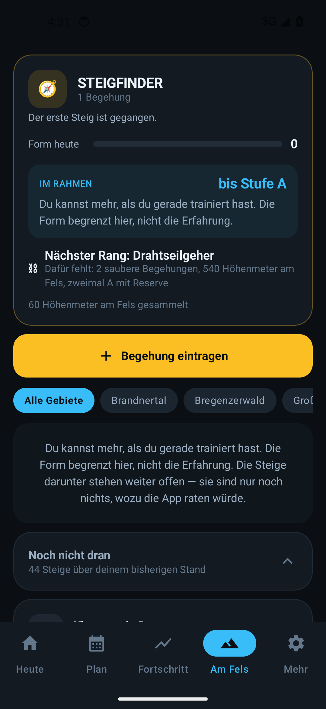
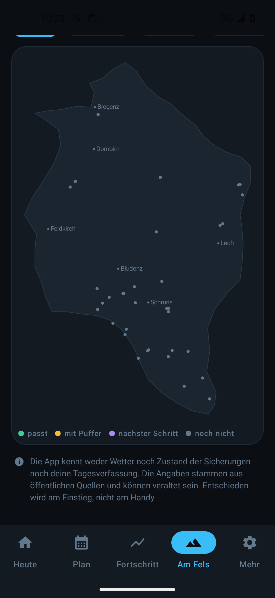
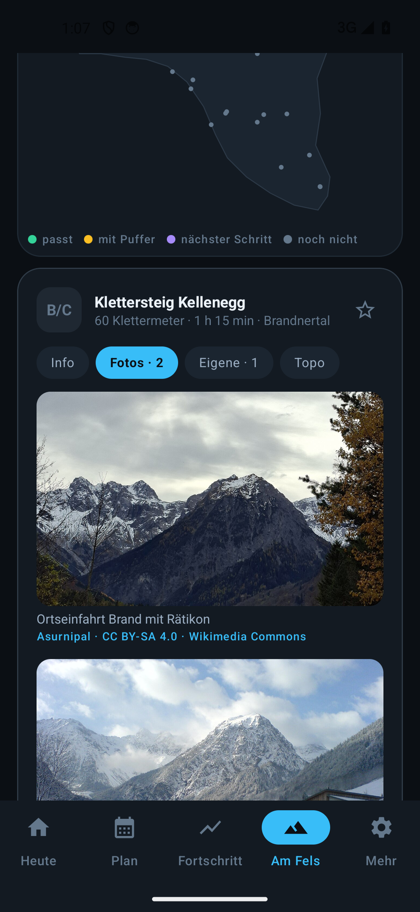
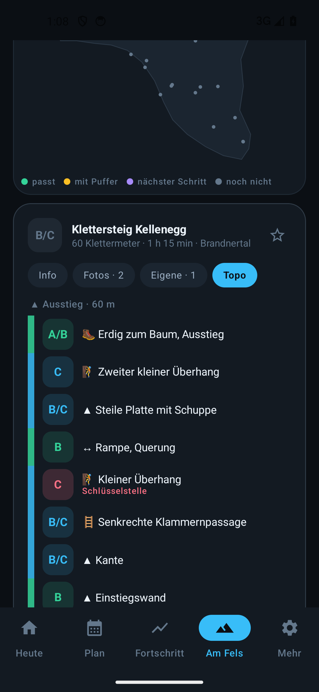

# 🏔 FerrataFit — Kraft für den Klettersteig

Trainings-App für das eigene Multifunktionsgerät, ausgelegt auf **Allgemeinfitness,
leichte Definition und bessere Leistung am Klettersteig** — als Android-App und Web-App.
Keine Anmeldung, keine Datensammlung, kein Server. Alles bleibt auf dem Gerät.

Die App führt dich Etappe für Etappe: **jeder Tag hat eine Aufgabe**, und erst wenn sie
steht, wird die nächste frei. Sie merkt sich jede Last und sagt von selbst, wann aus
40 kg 45 kg werden.

<div align="center">

[](https://github.com/Only1Rudeboy/FerrataFit/releases/latest/download/FerrataFit.apk)

</div>

## 📱 Nutzen

- **Android-App (APK):** [FerrataFit.apk herunterladen](https://github.com/Only1Rudeboy/FerrataFit/releases/latest/download/FerrataFit.apk)
  — Installation aus unbekannter Quelle bestätigen. Ab Android 8. Nur diese Variante
  kann mit Samsung Health sprechen.
- **Web-App (auch iPhone):** https://only1rudeboy.github.io/FerrataFit/
  — im Browser öffnen und über „App installieren" bzw. „Zum Home-Bildschirm hinzufügen"
  wie eine App verwenden. Läuft dank Service Worker auch ohne Netz.

| Heute | Am Fels | Karte | Fotos | Topo |
|---|---|---|---|---|
|  |  |  |  |  |

## ✨ Funktionen

- **Angefangenes bleibt erhalten** — wer während einer Einheit die App wechselt, findet
  jede eingetippte Zahl und die laufende Pausenuhr wieder vor
- **Ein Klettersteig zählt als Training** — die Begehung hakt die offene Etappe ab, mit
  den echten Klettermetern
- **Belastungsmodell** — jede Begehung bekommt eine Zahl aus Umfang, Grad, Gefühl und
  Puls; danach richtet sich, wie viel Erholung folgt und wie stark die Vorschläge sinken
- **Fotos zu jedem Steig** — 157 frei lizenzierte Bilder von Wikimedia Commons mit
  Urheber und Lizenz, nachgeladen erst beim Öffnen; dazu eigene Bilder aus Begehungen
  oder direkt angehängt
- **Topo zu jedem Steig** — schematischer Steigplan mit 307 Abschnitten: Grad, Art,
  Schlüsselstelle, Notausstiege
- **Automatische Sicherung** — einmal pro Woche still nach Documents/FerrataFit; wer die
  App versehentlich löscht, verliert nichts (Android 10+)
- **Tagesskizze je Route** — Zustieg, Wand, Abstieg mit Zeiten und Höhen; gestrichelt,
  was schematisch ist, durchgezogen nur die belegte Wand
- **Karte** — die Silhouette Vorarlbergs mit allen 44 Einstiegen, gefärbt nach Passung,
  komplett offline
- **44 Vorarlberger Klettersteige** mit Missionsübersicht: Die App sortiert sie danach,
  was zu deinem Stand passt — und schlägt nie mehr als eine Stufe über dem vor, was du
  zweimal mit Reserve gegangen bist
- **Steigpass** — Rang, Form und daraus die eine Zahl, die zählt: bis zu welcher Stufe
  du im Rahmen bist, samt Begründung, welche Achse gerade begrenzt
- **Etappen statt Trainingstage** — jeder Tag hat eine Aufgabe. Erst wenn sie steht,
  wird die nächste frei
- **Unterwegs-Modus** — auf Reisen weicht der Plan auf Körpergewichtsübungen aus; die
  Etappe zählt trotzdem voll
- **Tägliche Erinnerung** an die offene Etappe, Uhrzeit einstellbar
- **Einheiten nachbearbeiten** — Tippfehler korrigieren oder Einheit löschen
- **Aufwärmsätze** vor der ersten schweren Übung, bewusst nicht mitgezählt
- **Tapering** — in den letzten zwei Wochen vor der Tour geht das Volumen zurück
- **Aktualisierung in der App** — prüft auf neue Fassungen, lädt sie herunter und
  installiert sie. Kein Play Store nötig
- **Waagendaten** — Gewicht und Körperzusammensetzung kommen automatisch von der
  vernetzten Waage; die App rechnet aus, was das fürs Ziehen am Fels bedeutet
- **Vollständige Anleitung zu jeder Übung** — Aufbau, nummerierter Ablauf, typische
  Fehler, Zählweise, leichtere und schwerere Varianten. Dazu ein Videoverweis, falls
  Text allein nicht reicht
- **Automatische Gewichtsvorschläge** — die App erkennt, wann aufgelastet wird, und
  zeigt `40 kg → 45 kg` samt Begründung
- **Höhenmeter als Fortschritt** — jede Etappe bringt welche, die Summe führt über
  echte Gipfel bis zum Everest
- **Abzeichen** für Meilensteine: erster Klimmzug, Minute im Dead Hang, lückenloser Zyklus
- **Dehn- und Mobility-Etappen** mit Timer, Ausführung und Begründung je Übung
- **Spruch des Tages** — wechselt täglich, bleibt über den Tag stabil
- **Geräte-Abgleich** — beim Einrichten hakst du deine Stationen ab; es werden nur
  Übungen eingeplant, die dein Gerät hergibt
- **Satz-Logging mit Pausenuhr**, die beim Abhaken automatisch startet
- **Steig-Bereitschaft 0–100** aus Griffkraft, Zugkraft, Rumpf, Beinen und Regelmäßigkeit
- **Countdown zur geplanten Tour**
- **Verlaufskurven je Übung**, Bestleistungen, Einheiten pro Woche
- **Entlastungswochen** automatisch im Fünf-Wochen-Rhythmus
- **Samsung Health** über Health Connect — **nur lesend**, die App überträgt nichts dorthin
- **Export/Import** der kompletten Daten, auch zwischen App und Web-Variante

## 🎯 Der Steig — sieben Etappen im Zyklus

| # | Etappe | Inhalt | Hm |
|---|---|---|---|
| 1 | 💪 **Zug & Griff** | Klimmzug · Latzug · Rudern · Knieheben hängend · Curl · Dead Hang | 120 |
| 2 | 🧘 **Lockern** | Unterarme, Brust, Latissimus, Handgelenke | 40 |
| 3 | 🦵 **Beine & Steigkraft** | Step-up · Beinstrecker · Beinbeuger · Ausfallschritt · Wadenheben | 120 |
| 4 | 🧘 **Hüfte & Beine** | Hüftbeuger · Taube · Oberschenkel · Waden · Brustwirbelsäule | 40 |
| 5 | 💪 **Druck & Stabilität** | Brustpresse · Schulterdrücken · Butterfly · Reverse Butterfly · Trizeps | 120 |
| 6 | 🥾 **Rausgehen** | Wandern, Treppen oder Rad — mindestens 30 Minuten | 80 |
| 7 | 🌙 **Runterkommen** | Langes Dehnen, 30–90 Sekunden pro Position | 50 |

Der Zug-Tag steht vorne, weil Griff- und Zugkraft am Steig zuerst limitieren — die
willst du ausgeruht trainieren. Zwischen zwei Krafteinheiten liegt immer eine leichtere
Etappe: Das hält den Reiz hoch und gibt trotzdem Erholung. Der Druck-Tag hält die
Schultern im Gleichgewicht, denn wer nur zieht, zieht sich die Haltung nach vorne.

**Eine Etappe auslassen ist erlaubt** — die nächste wird trotzdem frei, es gibt nur
keine Höhenmeter dafür. Die App bremst nicht, sie belohnt.

## 📈 Wie gesteigert wird

**Doppelte Progression mit der 2-für-2-Regel.** Zuerst arbeitest du dich im
Wiederholungsfenster nach oben. Erst wenn du das obere Ende in **zwei aufeinander­
folgenden Einheiten** erreichst, kommt Gewicht drauf — und die Wiederholungen fallen
wieder auf den unteren Wert. Ein einzelner guter Tag reicht nicht.

| Situation | Vorschlag |
|---|---|
| Übung noch nie trainiert | Startschätzung aus dem Körpergewicht, konservativ |
| Oberes Ende in 2 Einheiten erreicht | **+1 Gewichtsstufe**, Wiederholungen zurück auf Minimum |
| Oberes Ende einmal erreicht | Halten — „noch eine Einheit, dann wird aufgelastet" |
| Normal unterwegs | Gleiche Last, eine Wiederholung mehr |
| 3 Einheiten ohne Fortschritt | **−10 %** und neu anlaufen |
| Woche 5 im Block | **−15 % Last, ein Satz weniger** |

Beim Dead Hang kommen fünf Sekunden dazu; ab einer Minute lohnt Zusatzgewicht mehr als
noch längeres Hängen.

Ausführlich mit Begründungen: [`docs/TRAININGSWISSEN.md`](docs/TRAININGSWISSEN.md)

## ⛰️ Höhenmeter und Gipfel

Jede abgeschlossene Etappe schreibt Höhenmeter gut. Die Summe führt über echte Gipfel —
das ist greifbarer als eine abstrakte Punktzahl:

| Höhenmeter | Gipfel |
|---|---|
| 300 | Erste Aussicht |
| 800 | Waldgrenze |
| 1.600 | Almhochtal |
| 2.600 | Hoher Freschen — *2.004 m, der Hausberg* |
| 4.000 | Piz Buin — *3.312 m, Vorarlbergs höchster* |
| 6.000 | Mont Blanc — *4.810 m* |
| 9.000 | Everest — *8.848 m* |

Ein vollständiger Wochenzyklus bringt 570 Höhenmeter. Bei der Ausdauer-Etappe zählen
deine echten Höhenmeter zusätzlich.

## 🧗 Am Fels — die Vorarlberger Klettersteige

Im Reiter **Am Fels** stehen 44 Vorarlberger Klettersteige mit Schwierigkeit, Klettermetern,
Zu- und Abstieg, Ausrüstung und Warnhinweisen. Aufnahmekriterium ist durchgehende Sicherung
über eine relevante Strecke und echter Klettercharakter — ein Wanderweg mit dreißig Metern
Drahtseil an einer ausgesetzten Stelle steht hier nicht drin, auch wenn ihn Tourismusseiten
als Klettersteig führen.

### Der Steigpass

Zwei Dinge entscheiden, was im Rahmen liegt — und die App nimmt immer den kleineren Wert:

| Achse | Woher sie kommt |
|---|---|
| **Erfahrung** | Die höchste Stufe, die du **zweimal mit Reserve** gegangen bist, plus eine |
| **Form** | Die Steig-Bereitschaft aus dem Training |

Daraus wird eine einzige Aussage: *„Im Rahmen: bis Stufe C"* — mit dem Satz dazu, welche
der beiden Achsen gerade begrenzt.

Ein Beispiel: Wer sehr stark trainiert, aber noch nie an einer ausgesetzten Stelle stand,
bekommt trotzdem nur B. Kraft ersetzt keine Routine. Umgekehrt gilt genauso: Wer bis D
erfahren, aber außer Form ist, liest *„Du kannst mehr, als du gerade trainiert hast."*

### Was die App niemals tut

- **Nie mehr als eine Stufe** über dem, was zweimal mit Reserve gegangen wurde — ohne
  Ausnahme, unabhängig von jeder Trainingszahl
- **Eine Stufe nach oben nur dort, wo Umkehren geht** — auf Routen mit Notausstieg oder
  auf kurzen. Nicht in der Mitte einer langen Wand
- **Eine knappe Begehung deckelt sofort.** Deine Rückmeldung schlägt jede Berechnung
- **Nach langer Pause eine Stufe zurück** — die erste Tour der Saison eine Nummer kleiner

### Umkehren zählt

Ein Abbruch schreibt die vollen Höhenmeter gut und kostet keinen Rang. Der Text dazu lautet
*„Umkehren ist eine Entscheidung, keine Niederlage — und die einzige, die man immer treffen
kann."* Wer meint, ein Abbruch sei ein Makel im Verlauf, kehrt beim nächsten Mal vielleicht
später um als gut wäre.

### Ränge

Sie belohnen Wiederholung und Umfang, nie den einen kühnen Versuch:

| Rang | Wofür |
|---|---|
| 🥾 Talgänger | Startpunkt |
| 🧭 Steigfinder | erste saubere Begehung |
| ⛓ Drahtseilgeher | 3 saubere · A bestätigt · 600 Hm |
| 🪜 Klammerkletterer | 6 saubere · B bestätigt · 1.800 Hm |
| 🧗 Wandgeher | 10 saubere · C bestätigt · 4.000 Hm |
| 🏔 Gratgeher | 16 saubere · D bestätigt · 8.000 Hm |
| ⛰️ Felsvertraut | 25 saubere · E bestätigt · 15.000 Hm |

*Sauber* heißt: durchgestiegen **und** mit Reserve am Ausstieg.

### Begehungen und der Wochenzyklus

Eine Begehung zählt als Training, verschiebt aber den Wochenrhythmus nicht. Sie steht
außerhalb des Zyklus — ein Steig wird gegangen, wenn Wetter und Zeit passen, nicht wenn
ein Plan es vorsieht.

### Zu den Angaben

Wo Quellen sich widersprechen — meist beim Schwierigkeitsgrad — steht das an der Route
dabei, statt Geratenes wie geprüfte Angaben aussehen zu lassen. Bei Zwischenstufen wie
`C/D` rechnet die App mit der schwereren.

> Die App kennt weder Wetter noch Zustand der Sicherungen noch deine Tagesverfassung.
> Die Angaben stammen aus öffentlichen Quellen und können veraltet sein.
> **Entschieden wird am Einstieg, nicht am Handy.**

## 🧗 Ein Klettersteig zählt als Training — je nach Tour verschieden viel

Der Übungssteig am Kellenegg ist nach einer guten Stunde vorbei, der Saulakopf ist ein
voller Bergtag mit 380 Klettermetern im Grad D. Beides pauschal gleich zu behandeln, wäre
in beide Richtungen falsch. Deshalb bekommt jede Begehung eine **Belastungszahl** aus vier
Quellen:

| Quelle | Was sie beiträgt |
|---|---|
| **Umfang** | Klettermeter und Gesamtdauer — die Grundmenge an Arbeit |
| **Schwierigkeit** | Der Grad als Faktor: dieselben Meter im D kosten mehr als im B |
| **Rückmeldung** | Wie es sich angefühlt hat — die ehrlichste Angabe von allen |
| **Uhr** | Der mittlere Puls aus der Aufzeichnung, falls vorhanden |

Und daraus folgt, was mit dem Wochenplan passiert:

| Belastung | Beispiel | Was der Plan macht |
|---|---|---|
| unter 20 | Übungssteig, eine Stunde | Höhenmeter zählen, Plan läuft normal — das war kein Trainingstag |
| 20–29 | Via Örfla, gemütlich | Etappe abgehakt, Plan läuft normal weiter |
| 30–59 | ordentlicher Trainingstag | Etappe abgehakt, **nächster Tag bewusst leichter** (−10 %) |
| 60–89 | Saulakopf | Etappe abgehakt, **24 h Erholung**, danach ein Tag leichter |
| ab 90 | großer Tag an der Grenze | Etappe abgehakt, **48 h Erholung**, danach ein Tag leichter |

„Erholung" heißt: Die App schiebt die nächste Krafteinheit auf und bietet stattdessen eine
Dehn-Einheit an — der Wochenzyklus wartet, nichts wird übersprungen. Die Erinnerung stupst
in der Zeit nicht zum Krafttraining. Wer trotzdem trainiert, kann — nur die
Gewichtsvorschläge bleiben gesenkt, denn genau dafür sind sie da.

### Die Uhr rechnet mit

Wurde die Tour mit der Uhr aufgezeichnet (Samsung Health → Health Connect), bietet das
Eintragsformular die Aufzeichnung zum Übernehmen an: Dauer und mittlerer Puls fließen in
die Belastungszahl ein. 90 Schläge im Mittel heißt gemütlich, 170 heißt Vollgas — die App
rechnet dann mit dem, was der Körper tatsächlich geleistet hat, nicht mit dem, was die
Route auf dem Papier ist. Übernommen wird nur auf Antippen; automatisch eingetragen wird
nichts.

Weiterhin gilt: Eine Begehung hakt **höchstens eine** Etappe pro Tag ab, und nur wenn an
dem Tag noch nichts abgehakt war. Die Belastungszahl ist dabei ausdrücklich **kein
Kompetenznachweis** — in die Steigpass-Empfehlung fließt sie nie ein. Was du *kannst*,
bestätigen nur saubere Begehungen; was ein Tag *gekostet* hat, ist eine andere Frage.

## 🗺️ Die Karte

Der Reiter „Am Fels" hat eine Kartenansicht: die Silhouette Vorarlbergs mit allen 44
Einstiegen, gefärbt nach Passung — grün passt, gelb mit Puffer, violett der nächste
Schritt. Ein Tipp auf einen Punkt öffnet die Routenkarte; Punkte am selben Fels wechseln
reihum.

Bewusst selbst gezeichnet statt einer Kartenbibliothek: Die App lädt nichts nach — keine
Kacheln, keine Fremdanbieter, funktioniert am Berg ohne Netz. Für den Zustieg braucht man
ohnehin eine echte Wanderkarte; die Koordinaten stammen aus OpenStreetMap und den
Tourenportalen und sind auf die Wand genau, nicht auf den Meter.

## 💾 Angefangenes geht nicht verloren

Android beendet Apps im Hintergrund, sobald es Speicher braucht. Wer während einer Einheit
kurz die Musik wechselt oder einen Anruf annimmt, kam früher in eine leere App zurück und
musste alle Sätze aller Übungen neu eintippen.

Seit 1.8 liegt der angefangene Zustand auf der Platte — jeder Satz, jeder Haken, die
Pausenuhr. Beim Zurückkommen steht alles wieder da.

- Die **Pausenuhr** wird als Endzeitpunkt gespeichert, nicht als Zähler. Sie läuft deshalb
  auch dann korrekt weiter, wenn die App zwischendurch gar nicht lief
- Der **Vorschlag** wird mit dem ursprünglichen Startzeitpunkt neu gerechnet. Nach einer
  Unterbrechung über Mitternacht steht dieselbe Empfehlung da wie vorher
- Bis **sechs Stunden** wird wortlos weitergemacht. Was älter ist, wird nicht ungefragt
  aufgeschlagen — wer nach zwei Tagen unvermittelt in einem halben Training landet, hakt
  im Zweifel Sätze ab, die er nie gemacht hat
- Eine über Nacht vergessene Einheit bekommt die Dauer **gedeckelt**, sonst stünden vierzehn
  Stunden Training im Verlauf

Dasselbe gilt für die Web-Fassung, dort über den Zwischenspeicher des Browsers.

## 📷 Fotos und Topo

Jede aufgeklappte Route hat vier Reiter: **Info**, **Fotos**, **Eigene**, **Topo**.

**Fotos** zeigt frei lizenzierte Bilder von **Wikimedia Commons** — 157 Fotos zu 43 der
44 Steige, jedes mit Urheber und Lizenz, denn genau das verlangen diese Lizenzen. Die App
bündelt die Bilder nicht, sie lädt sie erst, wenn der Reiter aufgeht, wie ein Browser es
täte. Ob Datei und Lizenz stimmen, hat der Generator (`tools/gen_media.py`) über die
Commons-API nachgeprüft; erlaubt sind nur CC0, CC BY, CC BY-SA, Public Domain und FAL.
Dazu der Link zur Galerie des Tourenportals, wo die Fotos liegen, die die App aus
Rechtsgründen nicht einbinden darf. Das Nachladen lässt sich unter **Mehr → Netz**
abschalten — es ist neben der App-Aktualisierung der einzige Netzzugriff der App.

**Eigene** sammelt deine Bilder: die aus Begehungen dieser Route und solche, die du
direkt an den Steig hängst. Verkleinert im App-Ordner (Android) bzw. in IndexedDB (Web);
das Original bleibt unangetastet.

**Medienpaket (Android):** Wer eigenes Material hat — Scans aus dem eigenen Führer, eine
Privatkopie der Tourenseiten für den persönlichen Gebrauch, Fotos von Freunden — packt es
als ZIP mit einer `index.json` und liest es unter **Mehr → Medienpaket** ein. Die Bilder
und Topos erscheinen dann im Foto- und Topo-Reiter des jeweiligen Steigs, antippen öffnet
sie groß mit Zoom. Das Paket bleibt auf dem Gerät; die App lädt davon nichts hoch und
bündelt nichts davon. Beim Einlesen wird jeder Pfad im Archiv geprüft — ein Paket, das
aus dem App-Ordner ausbrechen will, wird abgewiesen. Format: `index.json` mit
`{"routes": {"<steig-kennung>": {"photos": [{"file": "...", "caption": "...",
"source": "..."}], "topos": [...]}}}`, Kennungen wie in `FerrataRoutes.kt`.

**Topo** ist ein schematischer Steigplan: vom Einstieg unten zum Ausstieg oben, jeder
Abschnitt mit Grad, Art (Wand, Querung, Leiter, Brücke, Überhang, Höhle …) und
Schlüsselstelle, Notausstiege an ihrer Stelle. 307 Abschnitte zu allen 44 Steigen,
abgeleitet aus den Tourenbeschreibungen — Reihenfolge, Art und Grad sind Fakten und
damit frei; die Zeichnung ist unsere. Die gezeichnete Original-Topo von bergsteigen.com
ist Urheberwerk und gibt es deshalb nur als Link. Ein Test wacht darüber, dass keine
Topo einen Grad behauptet, der mehr als eine Stufe über dem Katalog liegt.

## 💾 Automatische Sicherung

Die Daten liegen im privaten App-Ordner — den nimmt Android beim Deinstallieren mit.
Deshalb legt die App einmal pro Woche still eine Kopie nach **Documents/FerrataFit/
FerrataFit-Sicherung.json** (eine Datei, wird überschrieben — kein wachsender Stapel).
Braucht keine Berechtigung (MediaStore, Android 10+); auf Android 8/9 gibt es nur den
Export von Hand. Der Zeitpunkt der letzten Sicherung steht unter **Mehr → Sicherung**.

## 🔄 Aktualisierung

Die App liegt nicht im Play Store, also aktualisiert sie sich selbst: Unter **Mehr →
App-Aktualisierung** prüft sie, ob eine neuere Fassung veröffentlicht wurde, zeigt die
Neuerungen, lädt die Datei herunter und übergibt sie dem Paketinstallierer von Android.

Beim ersten Mal fragt Android nach der Erlaubnis, Updates aus dieser App zu installieren —
das ist eine einmalige Freigabe in den Systemeinstellungen.

Dafür braucht die App Netzwerkzugriff. Der wird **ausschließlich** genutzt, um die
Veröffentlichungsseite auf GitHub abzufragen und die neue Fassung zu laden. Trainingsdaten
verlassen das Gerät nicht.

Die Web-Variante frischt sich beim Öffnen von selbst auf; unter **Mehr** gibt es zusätzlich
eine Schaltfläche, die den Zwischenspeicher leert und neu lädt.

## 🎒 Unterwegs

Kein Gerät greifbar? Unter **Mehr → Unterwegs** weicht der Plan auf Körpergewichtsübungen
aus: Latzug wird zu umgekehrtem Rudern an der Tischkante, Brustpresse zu Liegestützen,
Beinstrecker zur Kniebeuge. Mehr als einen Stuhl, eine Tischkante und ein Handtuch
brauchst du nicht.

**Die Etappe zählt dabei voll** — Höhenmeter, Serie und Abzeichen laufen weiter. Und der
Fortschritt geht auf keiner Seite verloren, weil jede Übung ihre eigene Geschichte führt:
Die Liegestütz-Reihe wächst unterwegs weiter, deine Brustpresse-Lasten stehen zu Hause
unverändert bereit.

## ⏰ Erinnerung

Unter **Mehr → Erinnerung** stellst du eine tägliche Benachrichtigung ein, die die gerade
offene Etappe nennt. Wer die Etappe früher am Tag abhakt, bekommt abends Ruhe.

Die App verwendet bewusst keine exakten Alarme — die verlangen ab Android 12 eine eigene
Freigabe, die Android 14 nur noch auf Nachfrage erteilt. Dafür kann die Erinnerung ein
paar Minuten später kommen als eingestellt.

Bleibt sie ganz aus, liegt es meist an der Akkuverwaltung: Samsung-Geräte schicken selten
genutzte Apps in den Tiefschlaf. FerrataFit dort auf „Nicht optimiert" stellen.

## ⚖️ Waage

Steht deine Waage über **FitDays** mit Samsung Health in Verbindung, holt die App Gewicht
und Körperzusammensetzung automatisch. Die Kette lautet:

```
FitDays → Samsung Health → Health Connect → FerrataFit
```

Beides muss einmalig eingeschaltet werden: in FitDays der Abgleich mit Samsung Health,
in Samsung Health der mit Health Connect. Danach genügt es, sich auf die Waage zu stellen —
die App holt die Werte beim nächsten Öffnen.

Übernommen werden Gewicht, Körperfettanteil, Magermasse, Wasser- und Knochenanteil sowie
der Grundumsatz, sofern deine Waage sie liefert. Das Körpergewicht wandert ins Profil und
verbessert damit die Lastschätzungen.

**Was daraus gerechnet wird:** Am Steig zählt nicht das Gewicht allein, sondern das
Verhältnis von Kraft zu Last. Ein Klimmzug bei 74 kg ist eine andere Übung als bei 78 kg.
Die App zeigt deshalb, wie viel Körpergewicht du je Wiederholung bewegst und was eine
Veränderung ungefähr an zusätzlichen Wiederholungen bedeutet. Sie ordnet nur ein, was
gemessen wurde — Zielgewichte gibt sie keine vor.

**Wenn die Kette nicht steht**, gibt es zwei Wege ohne Health Connect:

- **Eintragen** — Gewicht und Körperfett von Hand, direkt in der App
- **Datei** — eine aus FitDays geteilte Tabelle einlesen. Der Leser kommt mit Komma,
  Semikolon und Tabulator zurecht, erkennt deutsche wie englische Spaltennamen und
  akzeptiert Punkt wie Komma als Dezimaltrenner

Ein *direkter* Zugriff auf die FitDays-App ist nicht möglich: Android kapselt Apps
gegeneinander ab, und FitDays bietet keine Schnittstelle an. Das ist eine Grenze des
Systems, keine Entscheidung dieser App.

Die Web-Variante hat ohnehin keinen Zugang zu Health Connect; dort trägt man das Gewicht
von Hand ein, die Auswertung darunter ist dieselbe.

## ⌚ Samsung Health

Samsung bietet ein eigenes SDK an, das aber eine Partnerfreigabe voraussetzt und für
eine private App ausscheidet. Der offene Weg führt über **Health Connect**.

> **Die App liest nur.** Sie schreibt nichts nach Health Connect und fordert seit
> Fassung 1.8 auch keine Schreibrechte mehr an. Deine Einheiten bleiben auf dem Gerät
> und landen nicht in Googles Gesundheitsakte.

Gelesen werden Schritte, die Waagendaten aus FitDays und draußen aufgezeichnete Touren.
Aus einer Tour lässt sich eine Begehung eintragen — die App schlägt sie vor und trägt
sie nie von allein ein: Schwierigkeit und Gefühl weiß nur, wer dort war.

1. In FerrataFit auf **Mehr → Mit Samsung Health verbinden**
2. Health Connect fragt nach den Freigaben — bestätigen
3. In der Samsung-Health-App prüfen: *Einstellungen → Health Connect*

Ab Android 14 ist Health Connect fest im System eingebaut, auf älteren Geräten wird es
nachinstalliert.

**Wer vor 1.8 verbunden war:** Die frühere Fassung hatte die Freigabe *Training
schreiben* angefordert. Sie wird nicht mehr genutzt und lässt sich in Health Connect
unter *App-Berechtigungen → FerrataFit* entziehen. Bereits übertragene Einheiten stehen
weiterhin in Samsung Health und müssen dort gelöscht werden, wenn sie weg sollen.

## 📖 Quellen

- **Klettersteig-Vorbereitung:** [Der Klettersteiger](https://derklettersteiger.de/krafttraining-fuer-klettersteig/) · [DAV Summit Club](https://www.dav-summit-club.de/service/sicherheit-am-berg/vorbereitung-training) · [Deutscher Alpenverein](https://www.alpenverein.de/thema/training) · [British Mountaineering Council](https://thebmc.co.uk/en/via-ferrata)
- **2-für-2-Regel:** [Workouts by Winter](https://workoutsbywinter.substack.com/p/the-2-for-2-rule-a-fool-proof-formula)
- **Doppelte Progression:** [Legion Athletics](https://legionathletics.com/double-progression/) · [Mesostrength](https://mesostrength.com/blog/double-progression)
- **Entlastungswochen:** [A Practical Approach to Deloading, Sheffield Hallam University (PDF)](https://shura.shu.ac.uk/35313/3/Bell-APracticalApproach\(AM\).pdf) · [Sports Medicine Open](https://link.springer.com/article/10.1186/s40798-024-00691-y) · [Einwöchiger Deload, PMC](https://www.ncbi.nlm.nih.gov/pmc/articles/PMC10809978/)
- **Dead-Hang-Progression:** [DeadHangs.com](https://deadhangs.com/deadhang-progressions/) · [Mountain Tactical Institute](https://mtntactical.com/research/mini-study-two-progression-methods-improve-max-dead-hang-time-in-untrained-athletes/)
- **Kraftstation-Übungen:** [Hop-Sport](https://hop-sport.at/blog/kraftstation-ubungen-ganzkorper-trainingsplan-fur-anfanger) · [HAMMER](https://www.hammer.de/fitnesswissen/kraftstation-trainingsplan)
- **Health Connect:** [Android Developers](https://developer.android.com/health-and-fitness/health-connect/experiences/workouts) · [Samsung Developer](https://developer.samsung.com/health/blog/en/accessing-samsung-health-data-through-health-connect)
- **Klettersteige Vorarlberg:** [bergsteigen.com](https://www.bergsteigen.com/) · [klettersteig.de](https://klettersteig.de/) · [via-ferrata.de](https://www.via-ferrata.de/) · [vorarlberg.travel](https://www.vorarlberg.travel/aktivitaet/klettersteige/) · [montafon.at](https://www.montafon.at/) — je Route stehen die verwendeten Quellen in der App

Zu den Routendaten: Übernommen sind **Tatsachen** — Schwierigkeit, Höhenmeter, Zeiten,
Ausgangspunkte. Solche Angaben sind nicht schutzfähig. Die Beschreibungen sind neu
geschrieben, Fotos fremder Seiten sind bewusst keine eingebunden. Eigene Bilder kannst
du beim Eintragen einer Begehung hinzufügen.

Vollständige Liste mit Einordnung in [`docs/TRAININGSWISSEN.md`](docs/TRAININGSWISSEN.md).

## 🔧 Technik

**Android** — Kotlin mit Jetpack Compose und Material 3, minSdk 26, keine Datenbank:
Der gesamte Bestand liegt als einzelne JSON-Datei im App-Verzeichnis und ist damit
jederzeit als Text exportierbar. Health Connect für die Samsung-Anbindung.

**Web** — reines HTML, CSS und JavaScript ohne Build-Schritt, Daten im localStorage,
Service Worker für den Offline-Betrieb. Veröffentlicht über GitHub Pages direkt aus
diesem Repository; lokal genügt `cd web && python3 -m http.server 8765`.

Beide Varianten teilen dieselbe Trainings- und Etappenlogik. Damit sie nicht
auseinanderlaufen, prüfen beide Seiten dieselben Fälle — **128 Prüfungen insgesamt**:

```bash
node web/test-progression.mjs    # 13 Prüfungen: Gewichtssteigerung
node web/test-journey.mjs        # 44 Prüfungen: Etappen, Höhenmeter, Abzeichen, Anleitungen, Körper
node web/test-import.mjs         # 14 Prüfungen: Einlesen von Waagen-Dateien
```

Für die Android-Seite (108 Prüfungen):

```bash
cd android && JAVA_HOME=~/android/jdk ANDROID_HOME=~/android/sdk \
  FERRATAFIT_BUILD_DIR=~/.ferratafit-build \
  ~/android/tools/gradle-8.11.1/bin/gradle :app:testReleaseUnitTest
```

### Aufbau

```
FerrataFit/
├── android/          Android-App (Kotlin, Jetpack Compose)
│   ├── app/src/main/java/…/data/     Übungskatalog, Progression, Etappen, Speicherung
│   │   ├── Exercises.kt              Übungskatalog mit Ausführungsanleitungen
│   │   ├── Catalog.kt                Split und Zusammenstellung
│   │   ├── Progression.kt            Gewichtssteigerung
│   │   ├── Journey.kt                Etappen, Dehnkatalog, Höhenmeter, Abzeichen
│   │   ├── Draft.kt                  Angefangene Einheit — überlebt den App-Wechsel
│   │   ├── Ferrata.kt                Rang, Steigpass, Einordnung der Routen
│   │   ├── Recovery.kt               Belastungszahl und Erholungsfenster
│   │   ├── FerrataGeo.kt             Koordinaten für die Karte
│   │   ├── FerrataMedia.kt           Commons-Fotos und Topo-Abschnitte
│   │   └── FerrataRoutes.kt          Die 44 Klettersteige
│   ├── app/src/main/java/…/ui/       Oberfläche
│   ├── app/src/main/java/…/health/   Health Connect
│   ├── app/src/main/java/…/update/   Selbstaktualisierung über GitHub
│   ├── app/src/test/                 202 Tests
│   └── build.sh                      Bauen
├── web/              Web-App (ohne Build-Schritt)
│   ├── exercises.js                  Übungskatalog mit Ausführungsanleitungen
│   ├── data.js                       Split und Progression
│   ├── journey.js                    Etappen, Dehnkatalog, Höhenmeter, Abzeichen
│   ├── ferrata.js                    Rang, Steigpass, Einordnung der Routen
│   ├── ferratas.js                   Die 44 Klettersteige
│   └── test-*.mjs                    196 Prüfungen, inkl. Gleichlauf mit Android
└── docs/             Trainingswissen und Screenshots
```

### Signatur

Zugangsdaten stehen in `android/keystore.properties`, der Schlüssel in `android/keystore/`.
**Beides ist vom Repository ausgeschlossen** und muss lokal aufbewahrt werden. Ohne diese
Dateien baut Gradle weiter, nimmt dann aber den Debug-Schlüssel — eine so gebaute APK
lässt sich nicht über eine installierte Version legen.

---
*Privates Projekt. Trainingsempfehlungen ohne Gewähr — bei Vorerkrankungen oder Schmerzen
ärztlichen Rat einholen.*
